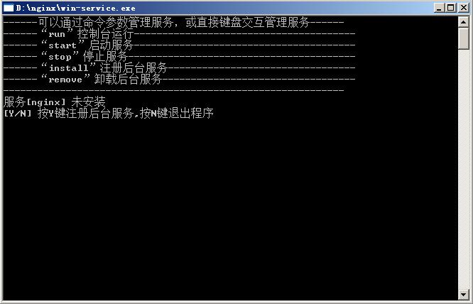

# win-service
基于aardio语言的Windows服务管理程序，赋予不支持安装为系统服务的程序（如nginx、node.js、批处理等）创建Windows Service，无任何环境依赖，配置简单。欢迎大家指导。

基于aardio官方范例改造。

当前最新版本： 1.0.0.02（发布日期：2021-06-05）

## 更新历史

- 2021-06-05 版本： 1.0.0.02
  1. service.json配置文件调整为utf8格式，解决中文创建服务乱码问题。
  2. 增加service.json配置文件存在中文等字符时字符编码必须是UT8格式的错误提示。
  3. 修复因执行程序进程启动失败，服务没切换到停止状态导致服务进程没有停止。

## 使用说明

### nginx服务安装示例

下载服务管理主程序`win-service.exe`及配置文件`service.json`并复制到nginx安装目录下。

`service.json`配置文件数据：

```json
    {
      "name": "nginx",
      "display_name": "Nginx Service",
      "description": "Nginx Service",
      "executable": "nginx.exe",
      "executable_args": "",
      "stop_args":"-s stop"
    }
```

确认配置没问题后打开`win-service.exe`管理程序按照提示操作即可。



